# S-AES_2023

## 结果展示

### 第一关：基本测试

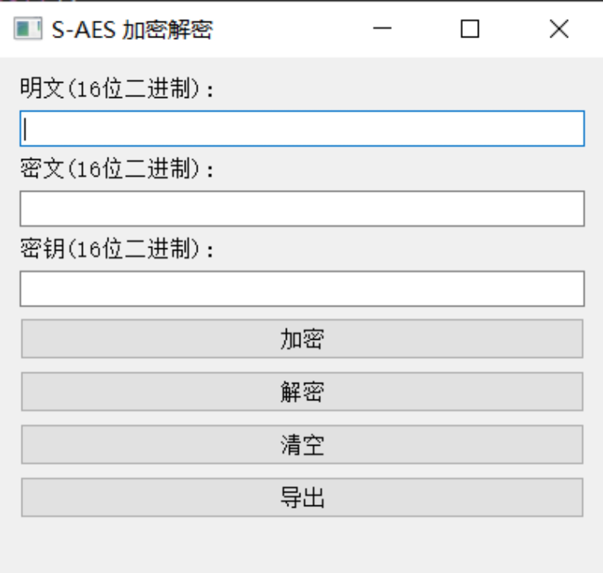

当输入的明文不符合要求的时候，会弹出报错提醒：

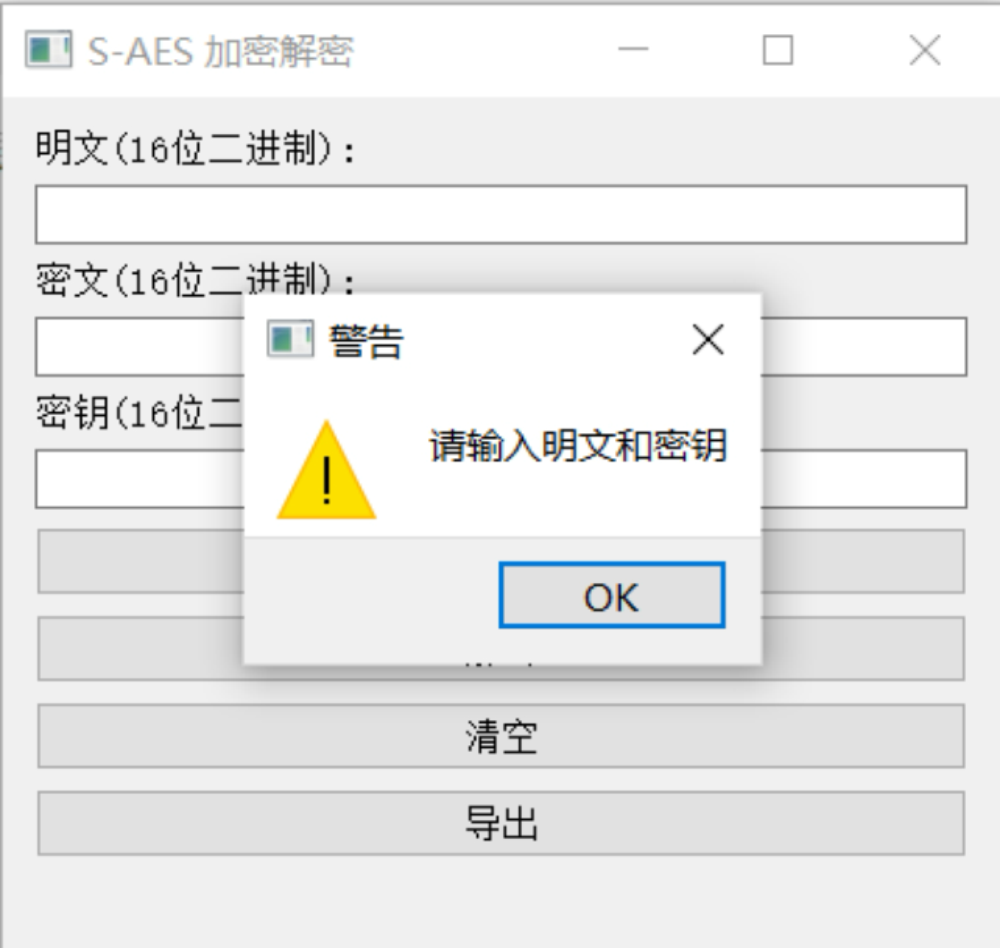


点击清空可以清除明文、密钥和密文文本框的内容。点击导出可以将结果保存在txt文件中。

加密测试
明文：1001101010110010
密钥：0110101110001101
加密结果：1100010010111010


解密测试
密文：1100010010111010
密钥：0110101110001101
解密结果：1001101010110010

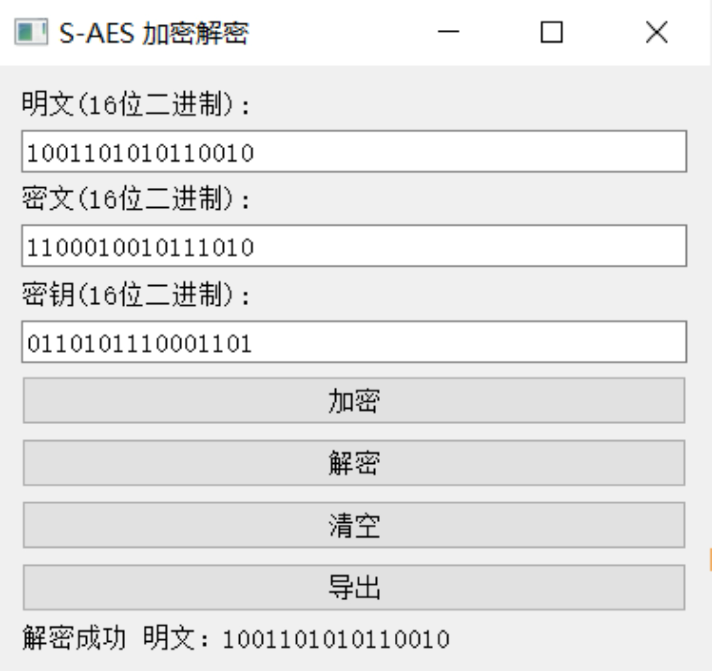

### 第三关：拓展功能

考虑到向实用性扩展，我们的程序允许输入任意长度的ASCII码字符串(分组为2Bytes)，并给出对应的ASCII码字符串密文(有可能是乱码)，同时也可以根据对应的密文和密钥进行解密。
对字符串“Hello!”进行加密：得到密文：H€-ÃEç)

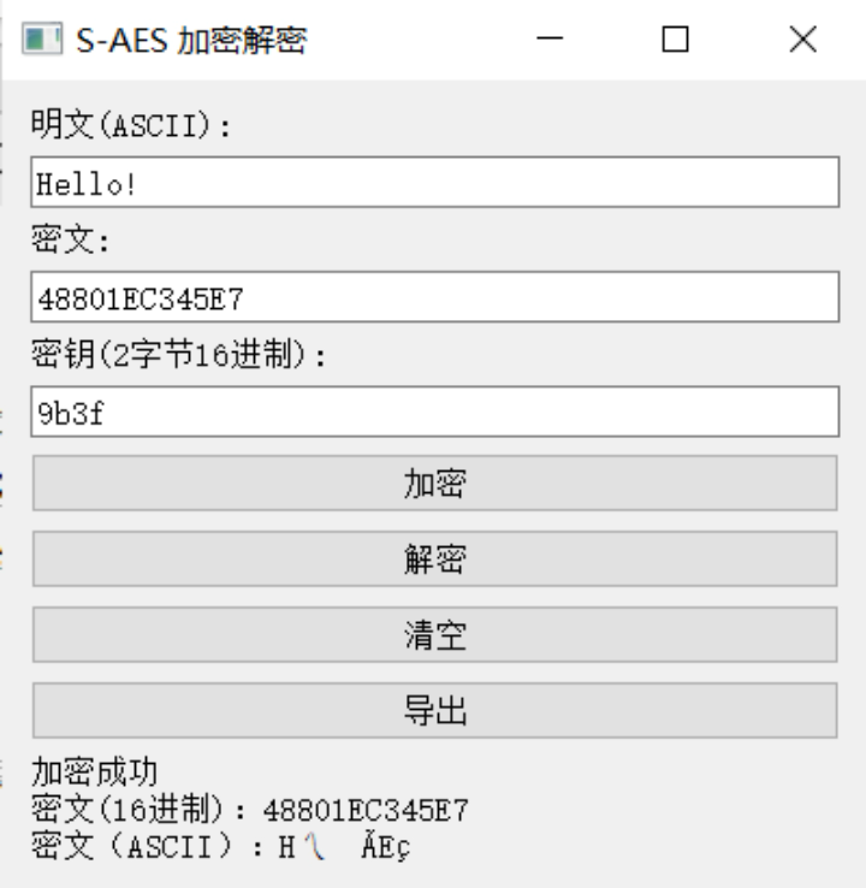

对上述密文进行解密，结果显示如下：

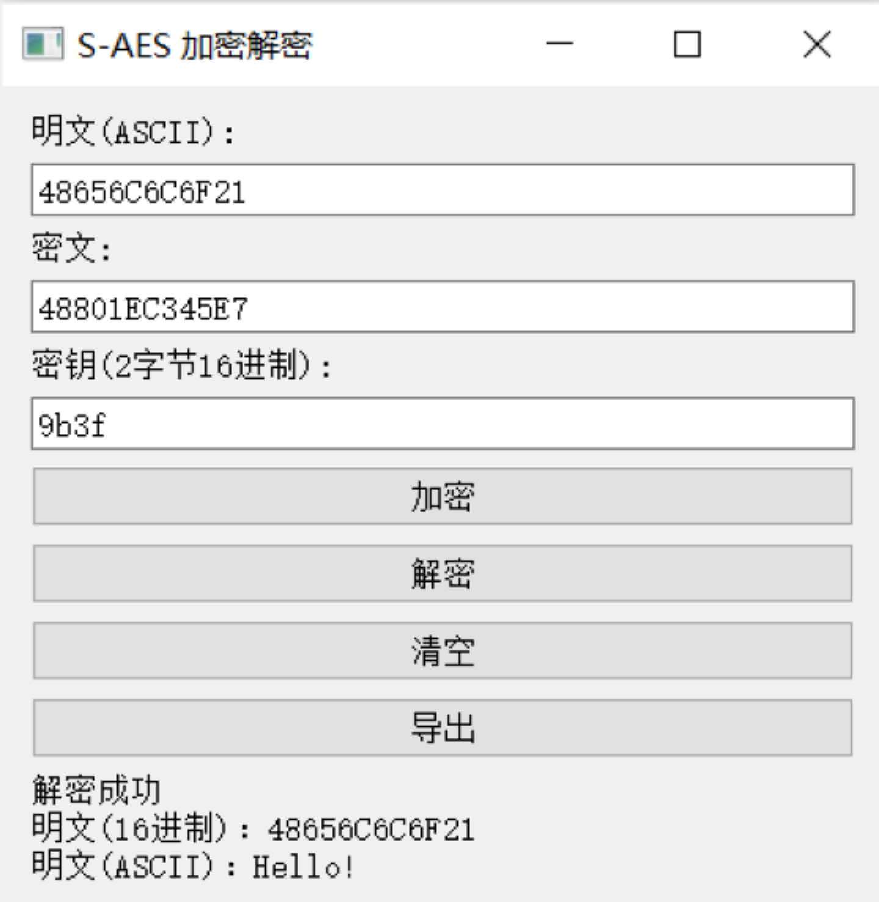

### 第四关：多重加密

根据要求我们扩展密钥至32bits，加密结果展示如下：

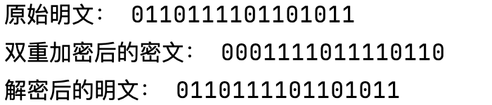

通过中间相遇攻击方法，获得可能的密钥为：

内容较多仅展示部分数据

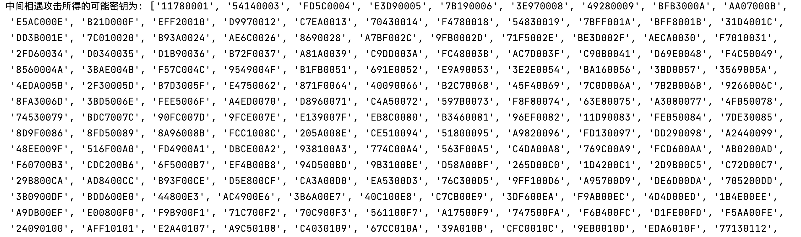

我们采用48bits的密钥进行三重加密


### 第五关：工作模式

我们选择较长的明文，在CBC模式下加密后，结果展示如下：

以下是密文被篡改的情况

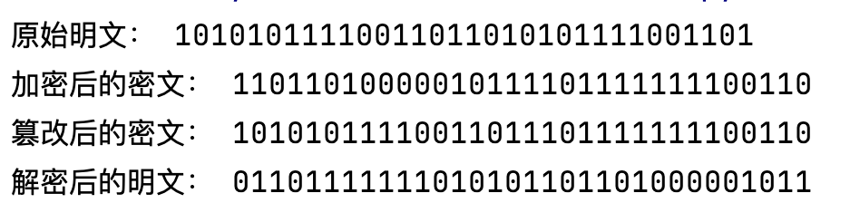

若不被篡改，则能够解密出原始明文

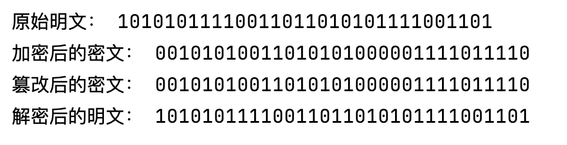

## 开发手册

### S-AES

#### S-AES简介

简化AES (S-AES) 算法是一种轻量级的密码方法，灵感来源于标准AES。

#### 核心功能与代码

##### 1. 基础功能

##### `xor(a, b)`:

计算两个整数的按位XOR。

```python
def xor(a, b):
    return a ^ b
```

##### 2.字节替代

我们首先定义一个简单的S_BOX。

```python
self.S_BOX = [
            [0x9, 0x4, 0xA, 0xB],
            [0xD, 0x1, 0x8, 0x5],
            [0x6, 0x2, 0x0, 0x3],
            [0xC, 0xE, 0xF, 0x7]
        ]

# Inverse S-Box for InvSubBytes step
self.INV_S_BOX = [
            [0xA, 0x5, 0x9, 0xB],
            [0x1, 0x7, 0x8, 0xF],
            [0x6, 0x0, 0x2, 0x3],
            [0xC, 0x4, 0xD, 0xE]
        ]
```

##### `sub_bytes(state)`:

使用 `S_BOX` 进行字节替代。

```python
    def sub_bytes(self, state):
        """SubBytes step for S-AES."""
        new_state = [[0, 0], [0, 0]]
        for i in range(2):
            for j in range(2):
                nibble = state[i][j]
                # 使用半字节的最左侧2位作为S盒的行索引
                sbox_row = (nibble >> 2) & 0x03
                # 使用半字节的最右侧2位作为S盒的列索引
                sbox_col = nibble & 0x03
                # 使用这两个索引从S盒中查找新的半字节值
                new_nibble = self.S_BOX[sbox_row][sbox_col]
                new_state[i][j] = new_nibble
        return new_state
```

##### `inv_sub_bytes(state)`:

使用 `INV_S_BOX` 进行反向字节替代。

```python
    def inv_sub_bytes(self, state):
        """Inverse SubBytes step for S-AES."""
        new_state = [[0, 0], [0, 0]]
        for i in range(2):
            for j in range(2):
                nibble = state[i][j]
                # 使用半字节的最左侧2位作为逆S盒的行索引
                sbox_row = (nibble >> 2) & 0x03
                # 使用半字节的最右侧2位作为逆S盒的列索引
                sbox_col = nibble & 0x03
                # 使用这两个索引从逆S盒中查找新的半字节值
                new_nibble = self.INV_S_BOX[sbox_row][sbox_col]
                new_state[i][j] = new_nibble
        return new_state
```

##### 3. 行移位

##### `shift_rows(state)`:

```python
    def shift_rows(self,state):
        new_state = []
        for i, row in enumerate(state):
            new_row = row[-i:] + row[:-i]
            new_state.append(new_row)
        return new_state
```

##### `inv_shift_rows(state)`:

```python
    def inv_shift_rows(self,state):
        return self.shift_rows(state)
```

##### 4. 列混合

##### `gf_mult(a, b)`:

在有限域GF(2^4)中的乘法。

```python
    def gf_mult(self,a, b):
        p = 0
        for counter in range(4):
            if b & 1: p ^= a
            hi_bit_set = a & 0x8
            a <<= 1
            if hi_bit_set: a ^= 0x13
            b >>= 1
        return p % 0x10
```

##### `mix_columns(state)`:

```python
 def mix_columns(self,state):
        new_state = []
        column_1=[]
        column_2=[]
        for row in state:
            column_1.append(row[0])
            column_2.append(row[1])
        new_row_1 = []
        new_row_2 = []
        new_row_1.append(column_1[0] ^ self.gf_mult(4, column_1[1]))
        new_row_1.append(column_2[0] ^ self.gf_mult(4, column_2[1]))
        new_row_2.append(self.gf_mult(4, column_1[0]) ^ column_1[1])
        new_row_2.append(self.gf_mult(4, column_2[0]) ^ column_2[1])
        new_state.append(new_row_1)
        new_state.append(new_row_2)
        return new_state
```

##### `inv_mix_columns(state)`:

```python
    def inv_mix_columns(self,state):
        new_state = []
        column_1 = []
        column_2 = []
        for row in state:
            column_1.append(row[0])
            column_2.append(row[1])
        new_row_1 = []
        new_row_2 = []
        new_row_1.append(self.gf_mult(9, column_1[0]) ^ self.gf_mult(2, column_1[1]))
        new_row_1.append(self.gf_mult(9, column_2[0]) ^ self.gf_mult(2, column_2[1]))
        new_row_2.append(self.gf_mult(2, column_1[0]) ^ self.gf_mult(9, column_1[1]))
        new_row_2.append(self.gf_mult(2, column_2[0]) ^ self.gf_mult(9, column_2[1]))
        new_state.append(new_row_1)
        new_state.append(new_row_2)
        return new_state
```

##### 5. 密钥处理

##### `rot_nib(word)`:

将16位字旋转4位。

```python
    def rot_nib(self,word):
        return (word << 4 | word >> 4) & 0xFF
```

##### `sub_nib(word)`:

组合新的密钥。

```python
    def sub_nib(self, word):
        """Substitute the nibbles of an 8-bit word using the S-Box."""

        # 高4位半字节
        high_nibble = (word >> 4) & 0x0F
        sbox_row_high = (high_nibble >> 2) & 0x03
        sbox_col_high = high_nibble & 0x03
        new_high_nibble = self.S_BOX[sbox_row_high][sbox_col_high]

        # 低4位半字节
        low_nibble = word & 0x0F
        sbox_row_low = (low_nibble >> 2) & 0x03
        sbox_col_low = low_nibble & 0x03
        new_low_nibble = self.S_BOX[sbox_row_low][sbox_col_low]

        # 组合新的8位字
        return (new_high_nibble << 4) | new_low_nibble
```

##### `key_expansion(key)`:

密钥的扩展与生成。

```python
def key_expansion(self,key):
    """Key expansion for S-AES."""
    w = [   key >> 8, key & 0xFF]  
    temp1=128
    temp2=48
    # Compute w2
    g_w1 = self.sub_nib(self.rot_nib(w[1]))
    w2 = w[0] ^ temp1 ^g_w1
    # Compute w3
    w3 = w2 ^ w[1]
    # Compute w4
    g_w3 = self.sub_nib(self.rot_nib(w3))
    w4 = w2 ^ temp2 ^ g_w3
    # Compute w5
    w5 = w4 ^ w3
    return [w[0], w[1], w2, w3, w4, w5]
```

##### 6.	加密与解密

根据加密和解密的逻辑撰写加密解密函数

```python
    def encrypt(self, plaintext, key):
        expanded_keys = self.key_expansion(key)
        round_keys = []
        for k in expanded_keys:
            binary_key = bin(k)[2:].zfill(8)
            round_keys.append(binary_key[:4])
            round_keys.append(binary_key[4:])
        #print("Round keys:", round_keys)
        # 轮密钥加
        state = [[plaintext[0][0] ^ int(round_keys[0], 2), plaintext[0][1] ^ int(round_keys[2], 2)],
                 [plaintext[1][0] ^ int(round_keys[1], 2), plaintext[1][1] ^ int(round_keys[3], 2)]]
        #print("After initial round key addition:", state)

        # 第1轮
        state = self.sub_bytes(state)
        #print("After SubBytes (Round 1):", state)
        state = self.shift_rows(state)
        #print("After ShiftRows (Round 1):", state)
        state = self.mix_columns(state)
        #print("After MixColumns (Round 1):", state)
        state = [[state[0][0] ^ int(round_keys[4], 2), state[0][1] ^ int(round_keys[6], 2)],
                 [state[1][0] ^ int(round_keys[5], 2), state[1][1] ^ int(round_keys[7], 2)]]
        #print("After round key addition (Round 1):", state)

        # 第2轮
        state = self.sub_bytes(state)
        #print("After SubBytes (Round 2):", state)
        state = self.shift_rows(state)
        #print("After ShiftRows (Round 2):", state)
        state = [[state[0][0] ^ int(round_keys[8], 2), state[0][1] ^ int(round_keys[10], 2)],
                 [state[1][0] ^ int(round_keys[9], 2), state[1][1] ^ int(round_keys[11], 2)]]
        #print("After final round key addition:", state)

        return state

    def decrypt(self, ciphertext, key):
        expanded_keys = self.key_expansion(key)
        round_keys = []
        for k in expanded_keys:
            binary_key = bin(k)[2:].zfill(8)
            round_keys.append(binary_key[:4])
            round_keys.append(binary_key[4:])

        # 初始轮密钥加
        state = [[ciphertext[0][0] ^ int(round_keys[8], 2), ciphertext[0][1] ^ int(round_keys[10], 2)],
                 [ciphertext[1][0] ^ int(round_keys[9], 2), ciphertext[1][1] ^ int(round_keys[11], 2)]]

        # 第1轮
        state = self.inv_shift_rows(state)
        state = self.inv_sub_bytes(state)
        state = [[state[0][0] ^ int(round_keys[4], 2), state[0][1] ^ int(round_keys[6], 2)],
                 [state[1][0] ^ int(round_keys[5], 2), state[1][1] ^ int(round_keys[7], 2)]]
        state = self.inv_mix_columns(state)

        # 第2轮
        state = self.inv_shift_rows(state)
        state = self.inv_sub_bytes(state)
        state = [[state[0][0] ^ int(round_keys[0], 2), state[0][1] ^ int(round_keys[2], 2)],
                 [state[1][0] ^ int(round_keys[1], 2), state[1][1] ^ int(round_keys[3], 2)]]

        return state
```

### GUI

#### **1. 简介**

这个应用程序提供了一个简单的图形用户界面 (GUI) 来演示简化AES (S-AES) 的加密和解密过程。

#### **2. 程序结构**

程序主要由以下部分组成:

- **SAESApp 类**: 主窗口类，包含所有的GUI组件和相关的逻辑。
- **main 函数**: 用于启动应用程序。
- **sAes**: 一个外部模块，包含S-AES的核心加密和解密逻辑。

#### **3. SAESApp 类**

##### 3.1. 初始化和界面设置

- `__init__(self)`: 构造函数，初始化sAes类实例和UI。
- `initUI(self)`: 初始化UI组件并设置窗口属性。

##### 3.2. UI组件

- **明文输入**:
  - `plain_text_label`: 标签，显示"明文(16位二进制):"
  - `plain_text_input`: 输入框，用于输入明文。
- **密文输入**:
  - `cipher_text_label`: 标签，显示"密文(16位二进制):"
  - `cipher_text_input`: 输入框，用于输入或显示密文。
- **密钥输入**:
  - `key_label`: 标签，显示"密钥(16位二进制):"
  - `key_input`: 输入框，用于输入密钥。
- **按钮**:
  - `encrypt_button`: "加密"按钮，用于触发加密操作。
  - `decrypt_button`: "解密"按钮，用于触发解密操作。
  - `clear_button`: "清空"按钮，用于清空所有输入框和显示的结果。
  - `export_button`: "导出"按钮，用于将明文、密钥、密文导出到一个文本文件。
- **结果显示**:
  - `result_label`: 标签，用于显示操作的结果。

##### 3.3. 功能函数

- `encrypt(self)`: 从输入框读取明文和密钥，执行加密，并将结果显示在相应的输入框和结果标签中。
- `decrypt(self)`: 从输入框读取密文和密钥，执行解密，并将结果显示在相应的输入框和结果标签中。
- `export_data(self)`: 导出明文、密钥、密文到一个文本文件。
- `clear(self)`: 清空所有输入框和显示的结果。


### Extended_sAES 开发手册

#### 1. 简介

这份手册为您提供了`Extended_sAes`类的详细说明。此类基于sAes加密算法进行扩展，增加了多种新功能，包括双重加密、三重加密以及CBC模式的支持。

#### 2. 主要方法

以下是`Extended_sAes`中的主要方法：

##### 2.1. 双重加密与解密
- `double_encrypt(plaintext, key)`：使用32位密钥进行双重加密。

  ```python
      def double_encrypt(self, plaintext, key):
          # 从32位密钥中拆分为两个16位密钥
          key1 = (key >> 16) & 0xFFFF
          key2 = key & 0xFFFF
  
          # 使用第一个密钥加密
          intermediate_ciphertext = super().encrypt(plaintext, key1)
          # 使用第二个密钥再次加密
          final_ciphertext = super().encrypt(intermediate_ciphertext, key2)
  
          return final_ciphertext
  ```

  

- `double_decrypt(ciphertext, key)`：使用32位密钥进行双重解密。

  ```python
      def double_decrypt(self, ciphertext, key):
          # 从32位密钥中拆分为两个16位密钥
          key1 = (key >> 16) & 0xFFFF
          key2 = key & 0xFFFF
  
          # 使用第二个密钥解密
          intermediate_plaintext = super().decrypt(ciphertext, key2)
          # 使用第一个密钥再次解密
          final_plaintext = super().decrypt(intermediate_plaintext, key1)
  
          return final_plaintext
  ```

  

##### 2.2. 三重加密与解密
- `triple_encrypt(plaintext, key1, key2, key3)`：使用三个16位密钥进行三重加密。

  ```python
      def triple_encrypt(self, plaintext, key1, key2, key3):
          # 使用第一个密钥K1进行加密
          ciphertext1 = self.encrypt(plaintext, key1)
          # 使用第二个密钥K2进行加密
          ciphertext2 = self.encrypt(ciphertext1, key2)
          # 使用第三个密钥K3进行加密
          ciphertext3 = self.encrypt(ciphertext2, key3)
          # 返回最终的密文
          return ciphertext3
  ```

  

- `triple_decrypt(ciphertext, key1, key2, key3)`：使用三个16位密钥进行三重解密。

  ```python
      def triple_decrypt(self, ciphertext, key1, key2, key3):
          # 使用第三个密钥K3进行解密
          intermediate_plaintext2 = self.decrypt(ciphertext, key3)
          # 使用第二个密钥K2进行解密
          intermediate_plaintext1 = self.decrypt(intermediate_plaintext2, key2)
          # 使用第一个密钥K1进行解密
          plaintext = self.decrypt(intermediate_plaintext1, key1)
          # 返回最终的明文
          return plaintext
  ```

  

##### 2.3. 中间相遇攻击
- `meet_in_the_middle_attack(plaintext, ciphertext)`：对双重加密进行中间相遇攻击，尝试找到可能的密钥。

  ```python
   def meet_in_the_middle_attack(self, plaintext, ciphertext):
          # 初始化一个空字典，用于存储中间值与密钥的映射
          intermediate_values = {}
          res = []
          # 枚举所有可能的16位密钥
          for key1 in range(0x10000):
              # 使用第一个密钥加密明文
              intermediate_value = self.matrix_to_int(self.encrypt(plaintext, key1))
  
              # 将中间值与第一个密钥映射存储在字典中
              intermediate_values[intermediate_value] = key1
  
          # 枚举所有可能的16位密钥
          for key2 in range(0x10000):
              # 使用第二个密钥解密密文
              intermediate_value = self.matrix_to_int(self.decrypt(ciphertext, key2))
  
              # 检查中间值是否在字典中
              if intermediate_value in intermediate_values:
                  # 如果找到匹配的中间值，表示成功找到了密钥
                  key1 = intermediate_values[intermediate_value]
                  key2 = key2
                  # 合并密钥并以16进制表示
                  combined_key = "{:04X}".format((key1 << 16) | key2)
                  res.append(combined_key)
          return res
  ```

  

##### 2.4. CBC模式
- `cbc_encrypt(plaintext, key, iv)`：使用CBC模式进行加密。

  ```python
      def cbc_encrypt(self, plaintext, key, iv):
          # 初始化一个空的密文列表
          ciphertext = []
          plaintexts = self.split_into_16_bit_groups(plaintext)
          # 对每个明文分组进行加密
          for block in plaintexts:
              # 将明文分组与前一个密文分组（或IV）进行异或运算
              if not ciphertext:
                  # 如果是第一个分组，使用初始向量
                  prev_block = iv
              else:
                  prev_block = ciphertext[-1]
  
              xored_block = block ^ prev_block
              xored_block_expand = bin(xored_block)[2:].zfill(16)
              #print('异或后的分组：', xored_block_expand)
              plaintext_matrix = [
                  [int(xored_block_expand[0:4], 2), int(xored_block_expand[8:12], 2)],
                  [int(xored_block_expand[4:8], 2), int(xored_block_expand[12:16], 2)]
              ]
  
              # 使用密钥加密异或后的分组
              encrypted_block = self.encrypt(plaintext_matrix, key)
              concatenated_binary = bin(encrypted_block[0][0])[2:].zfill(4) + bin(encrypted_block[1][0])[2:].zfill(
                  4) + bin(encrypted_block[0][1])[2:].zfill(4) + bin(encrypted_block[1][1])[2:].zfill(4)
              #print('加密后的分组：', concatenated_binary)
              # 将加密后的分组添加到密文列表
              ciphertext.append(int(concatenated_binary, 2))
  
          return ciphertext
  ```

  

- `cbc_decrypt(ciphertext, key, iv)`：使用CBC模式进行解密。

  ```python
   def cbc_decrypt(self, ciphertext, key, iv):
          # 初始化一个空的明文列表
          plaintexts = []
          ciphertexts = self.split_into_16_bit_groups(ciphertext)
          #print(ciphertexts)
          # 对每个密文分组进行解密
          for block in ciphertexts:
              # 使用密钥解密密文分组
              ciphertext_block = bin(block)[2:].zfill(16)
              ciphertext_block_matrix = [
                  [int(ciphertext_block[0:4], 2), int(ciphertext_block[8:12], 2)],
                  [int(ciphertext_block[4:8], 2), int(ciphertext_block[12:16], 2)]
              ]
              decrypted_block_matrix = self.decrypt(ciphertext_block_matrix, key)
              #print('解密后的分组：', decrypted_block_matrix)
              # 将解密后的分组与前一个密文分组（或IV）进行异或运算
              if not plaintexts:
                  # 如果是第一个分组，使用初始向量
                  prev = bin(iv)[2:].zfill(16)
  
              else:
                  prev = bin(ciphertexts[-2])[2:].zfill(16)
              prev_block = [
                  [int(prev[0:4], 2), int(prev[8:12], 2)],
                  [int(prev[4:8], 2), int(prev[12:16], 2)]
              ]
              xored_block_matrix = [
                  [decrypted_block_matrix[0][0] ^ prev_block[0][0], decrypted_block_matrix[0][1] ^ prev_block[0][1]],
                  [decrypted_block_matrix[1][0] ^ prev_block[1][0], decrypted_block_matrix[1][1] ^ prev_block[1][1]]
              ]
              #print('异或后的分组：', xored_block_matrix)
              plaintext = bin(xored_block_matrix[0][0])[2:].zfill(4) + bin(xored_block_matrix[1][0])[2:].zfill(4) + bin(
                  xored_block_matrix[0][1])[2:].zfill(4) + bin(xored_block_matrix[1][1])[2:].zfill(4)
              # 将异或运算结果添加到明文列表
              plaintexts.append(plaintext)
  
          # 将明文列表中的分组合并成一个整体明文
          plaintexts = ''.join(plaintexts)
  
          return plaintexts
  ```

  

##### 2.5. 辅助方法
- `matrix_to_int(matrix)`：将2x2矩阵转换为整数。
- `generate_random_iv()`：生成16位随机初始向量（IV）。
- `split_into_16_bit_groups(number)`：将32位数字分成两个16位组。

#### 3. 使用示例

以下是如何使用`Extended_sAes`类的示例：

```python
# 示例1: 双重加密与解密
aes = Extended_sAes()
plaintext = [[0x6, 0x6], [0xf, 0xb]]
key = 0x11780001
print("原始明文：", trans(plaintext))
ciphertext = aes.double_encrypt(plaintext, key)
print("双重加密后的密文：", trans(ciphertext))
decrypted_plaintext = aes.double_decrypt(ciphertext, key)
print("解密后的明文：", trans(decrypted_plaintext))

# 示例2: 三重加密与解密
key1 = 0xa73b
key2 = 0xa24c
key3 = 0x1178
ciphertext = aes.triple_encrypt(plaintext, key1, key2, key3)
print("三重加密后的密文：", trans(ciphertext))
decrypted_plaintext = aes.triple_decrypt(ciphertext, key1, key2, key3)
print("解密后的明文：", trans(decrypted_plaintext))

# 示例3: CBC模式
plaintext = 0xABCDABCD  # 32bits
key = 0xa73b
iv = aes.generate_random_iv()
ciphertext = aes.cbc_encrypt(plaintext, key, iv)
binary_string = "".join([bin(num)[2:].zfill(16) for num in ciphertext])
print("CBC模式加密后的密文：", binary_string)
decrypted_plaintext = aes.cbc_decrypt(ciphertext, key, iv)
print("解密后的明文：", decrypted_plaintext)
```

#### 4. 结论

此`Extended_sAes`类为开发者提供了多种加密和解密方法，使得在多种场景下的安全性得到了增强。此外，也包括了中间相遇攻击的方法，帮助了解并提高算法的安全性。


## 用户指南

### S-AES 加密解密工具

S-AES（Simplified Advanced Encryption Standard）是一种用于数据加密的简化版本的AES算法。这个工具提供了一个图形用户界面，用于加密和解密文本数据。以下是如何使用这个工具的步骤。

#### 步骤 1: 启动工具

运行应用程序，它会打开S-AES加密解密工具的用户界面。

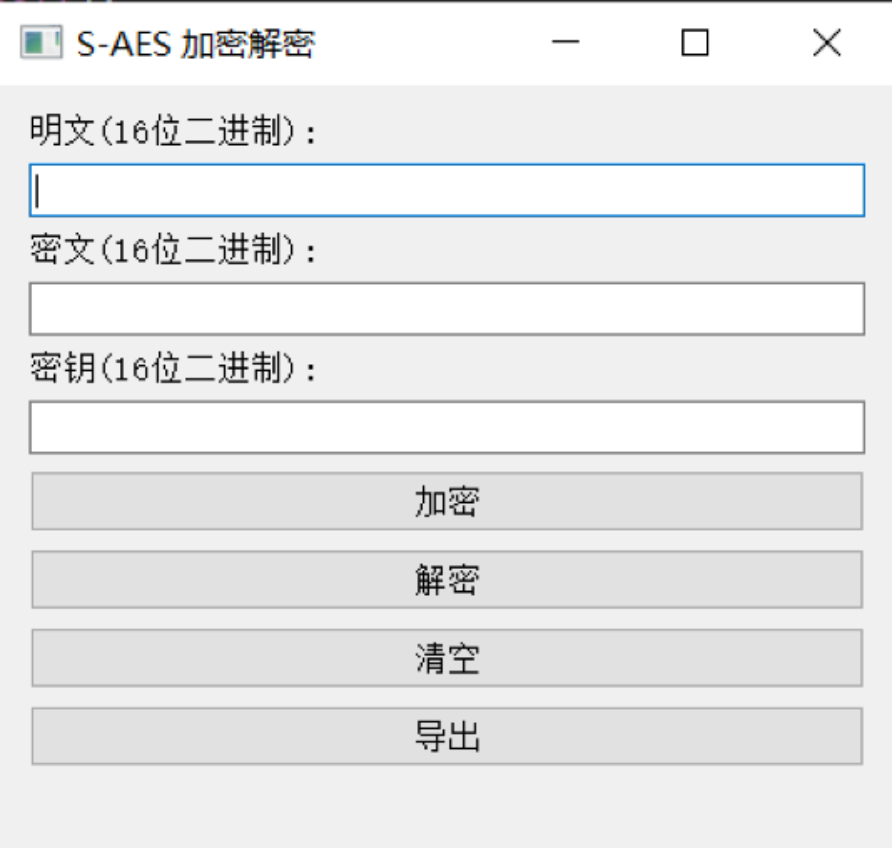

#### 步骤 2: 输入明文

在明文输入框中输入要加密的文本。确保输入的文本是16位的二进制数据或者是任意的ASCII码字符串。

#### 步骤 3: 输入密钥

在密钥输入框中输入加密所需的密钥。密钥是16位的二进制数据或者2字节十六进制数据。

#### 步骤 4: 加密或解密

点击 "加密" 按钮，系统将使用输入的明文和密钥执行加密操作。加密结果将显示在导出按钮下方。

如果您有一个已知的密文和相应的密钥，您可以在密文输入框中输入密文，以及对应的密钥，然后点击 "解密" 按钮来解密数据。解密结果将显示在导出按钮下方。

#### 步骤 5: 导出结果

如果需要，您可以点击 "导出" 按钮将加密或解密的结果保存到文件中。


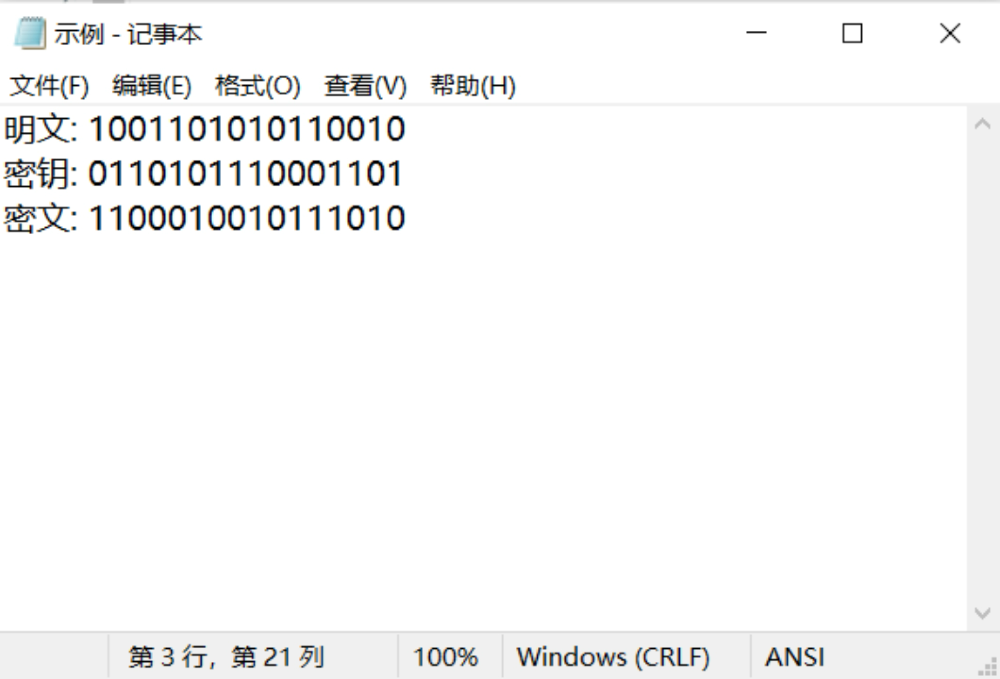


### 安全性和注意事项

#### 1.S-AES的安全性:

S-AES的安全性相对较低，主要是由于其较小的密钥空间和简化的结构所导致的：
（1）密钥空间：S-AES使用16位密钥，相比于原始AES的128位密钥，密钥空间要小得多。这意味着攻击者可以通过穷举搜索（brute-force）等方法更容易地找到正确的密钥。
（2）线性和差分攻击：S-AES的S盒（Substitution Box）是通过查找预定义的替换表进行字节代换的。这种结构容易受到线性和差分密码分析攻击的影响，从而可能降低了算法的安全性。
（3）结构简化：S-AES是对原始AES算法的简化版本，去除了一些复杂的操作和轮数。这种简化可能导致更容易受到各种攻击，如差分攻击、线性攻击和相关密钥攻击等。
总的来说，S-AES适用于资源受限的环境，但在对安全性要求较高的应用中，建议使用原始的AES算法。原始的AES算法具有更大的密钥空间和更复杂的结构，经过广泛的研究和分析，被认为是安全可靠的加密算法。

#### 2.密钥管理:

S-AES的密钥管理涉及到密钥生成、密钥存储和密钥分发等方面。
（1）密钥生成：在使用S-AES之前，需要生成一个合适的密钥。S-AES使用16位的密钥，可以通过伪随机数生成器（PRNG）生成一个随机的16位二进制字符串作为密钥。
（2）密钥存储：生成的密钥需要安全地存储起来，以防止未经授权的访问。在实际应用中，可以将密钥存储在安全的硬件模块（如加密芯片）中，或者使用密钥管理系统进行安全存储。
（3）密钥分发：如果需要将密钥传输给其他参与方，确保密钥的安全传输是至关重要的。可以使用安全通信渠道，如加密的网络连接或物理传递，来传输密钥。此外，也可以使用密钥交换协议（如Diffie-Hellman密钥交换）来安全地协商和分发密钥。
（4）密钥更新：为了保持系统的安全性，定期更新密钥是必要的。根据具体需求，可以选择定期更换密钥，或者使用密钥派生函数（如HMAC-SHA256）根据旧密钥生成新密钥。
在实际应用中，密钥管理是确保系统安全的重要环节。除了上述措施外，还应注意密钥的保密性、完整性和可用性，以及对密钥进行备份和恢复等方面的处理，以确保密钥的有效管理和使用。

#### 常见问题解答

Q: S-AES与标准AES的区别
A: S-AES是一种简化版的AES算法，有以下区别：
（1）密钥长度：S-AES使用16位密钥，标准AES可以使用128位、192位或256位密钥。因此，S-AES的密钥空间比标准AES要小得多。
（2）轮数：S-AES只使用4轮加密和解密操作，标准AES使用10轮（128位密钥）、12轮（192位密钥）或14轮（256位密钥）加密和解密操作。因此，S-AES的加密和解密速度更快，但安全性相对较低。
（3）S盒：S-AES使用了一个4x4的S盒来进行字节代换操作，标准AES使用了一个8x8的S盒。S-AES的S盒是通过查找预定义的替换表进行字节代换的，标准AES的S盒是通过一系列复杂的数学运算生成的。
（4）结构：S-AES的结构比标准AES简单，去除了一些复杂的操作和结构，如置换层和逆置换层等。这使得S-AES更容易实现和部署，但也降低了其安全性。
总的来说，S-AES是一种适用于资源受限环境的加密算法，其安全性相对较低，但速度更快。标准AES是一种更安全的加密算法，但需要更大的计算资源和更长的加密时间。根据具体需求，可以选择适合的加密算法。

Q: 为什么我无法解密我的数据？
A: 请检查您输入的密钥是否正确，确保与加密时使用的密钥相同。密钥必须准确匹配，否则无法成功解密数据。

Q: 我忘记了密钥，如何解密数据？
A: 如果您忘记了密钥，很遗憾，无法解密数据。S-AES是一种对称加密算法，密钥是解密的唯一途径。请确保密钥的安全保存。

技术支持和反馈
如果您遇到任何问题或需要技术支持，请联系我们的技术支持团队：20214795@cqu.edu.cn
