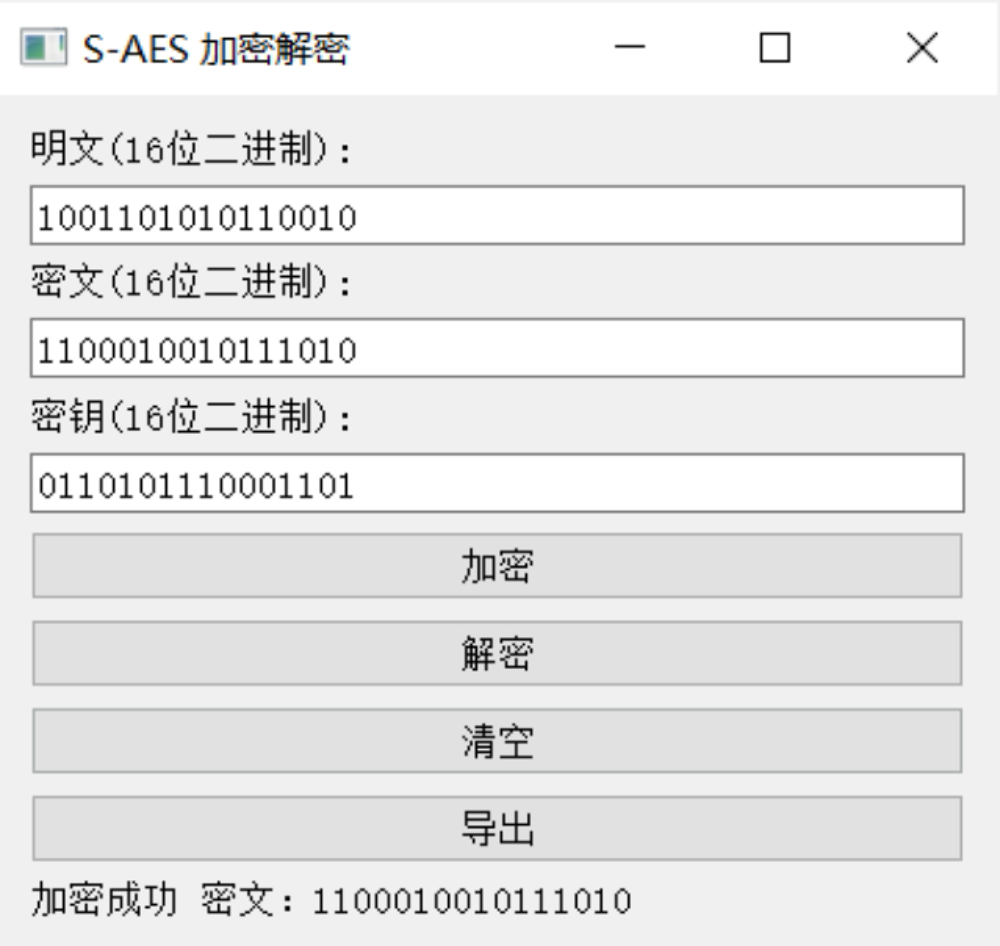

# S-AES_2023

## 结果展示

### 第一关：基本测试

当输入的明文不符合要求的时候，会弹出报错提醒：

点击清空可以清除明文、密钥和密文文本框的内容。点击导出可以将结果保存在txt文件中。

加密测试
明文：1001101010110010
密钥：0110101110001101
加密结果：1100010010111010

解密测试
密文：1100010010111010
密钥：0110101110001101
解密结果：1001101010110010

### 第三关：拓展功能

考虑到向实用性扩展，我们的程序允许输入任意长度的ASCII码字符串(分组为2Bytes)，并给出对应的ASCII码字符串密文(有可能是乱码)，同时也可以根据对应的密文和密钥进行解密。
对字符串“Hello!”进行加密：得到密文：H€-ÃEç)

对上述密文进行解密，结果显示如下：

### 第四关：多重加密

根据要求我们扩展密钥至32bits，加密结果展示如下：

通过中间相遇攻击方法，获得可能的密钥为：

内容较多仅展示部分数据

我们采用48bits的密钥进行三重加密

### 第五关：工作模式

我们选择较长的明文，在CBC模式下加密后，结果展示如下：

以下是密文被篡改的情况

若不被篡改，则能够解密出原始明文

## 开发手册

## 用户指南
